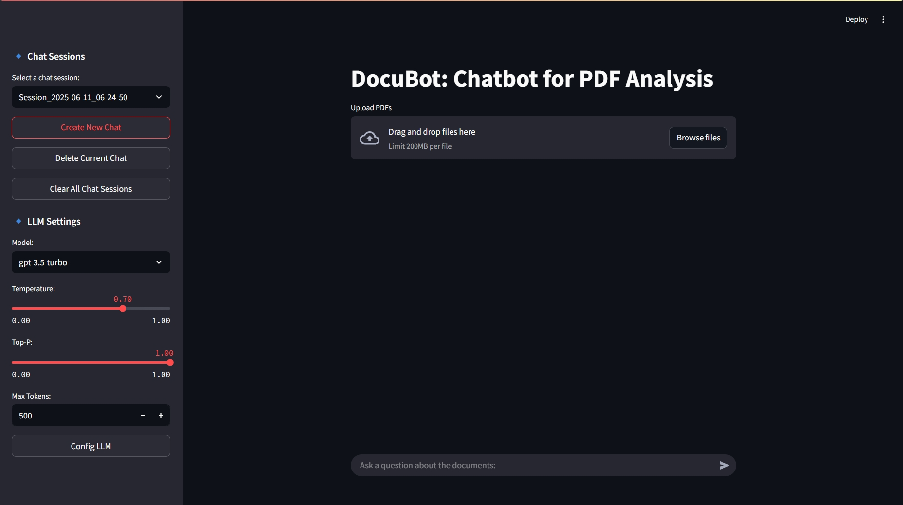

# DocuBot: Chatbot for PDF Analysis

## Dependencies
Skip this if you are planning to run the application using containerized execution. You may install the dependencies using the following command:

    pip install streamlit pdfplumber openai langchain chromadb python-dotenv langchain-community tiktoken

## Configuring OpenAI API Key
To run this application you need to set the OpenAI API key in the .env file. In the *.env* file, set the variable OPENAI_API_KEY with your own openAI API key:

    OPENAI_API_KEY=your_openAI_API_key

## Running the Application
Option 1: Direct Execution

To run the application, run the following command on your CLI where the folder is located:

    streamlit run bot.py

Option 2: Containerized Execution

To run the application, run the following commands on your CLI where the folder is located:

    docker build -t docubot_image .
    docker run -d -p 8501:8501 --name docubot_container docubot_image

Open http://localhost:8501/ to view the application.

## General Overview of the Application

To use to application, upload a PDF. Once a PDF is successfully uploaded, a text similar to the one below will appear.

> Uploaded Reference Files: your_pdf_file.pdf

You may then ask questions related to the uploaded documents. 
If no file is uploaded, you will be notifed to upload a PDF first. The application can handle many file uploads. 
For multiple PDF uploads, you can remove an uploaded file as a reference for the chatbot by clicking the "X" button that appears beside the file name after successful file upload.

You may start a new chat by clicking the "*Create New Chat*" button on the left sidebar. Your current chat session will be automatially saved. You may also "*Delete Current Cha*t" or "*Clear All Chat Sessions*". You may also choose which chat session to load and continue the session.

You may also configure the settings of the LLM on the left sidebar by selecting the model, temperature, top-p, and max tokens values for the LLM. Click the "*Conifg LLM*" button to apply the chosen parameter values.

# Project Journal
## Design Decisions and Solutions Implemented
The development of the DocuBot application was driven by the need to create a scalable, modular, and efficient chatbot for analyzing PDF documents. By leveraging Streamlit, LangChain, and OpenAI’s LLM, the architecture prioritizes modular code design, session-based conversation management, and dynamic LLM configuration.

One of the core design decisions was structuring the application into three separate Python files:

    - main.py: Handles core functionality, including UI management, document processing, and chatbot interactions.

    - session_manager.py: Manages chat sessions, ensuring that previous conversations and context are accessible when needed.

    - llm_config.py: Provides a dynamic interface for configuring LLM parameters, making chatbot responses customizable.

This modular approach ensures easier debugging, scalability, and separation of concerns. Each component serves a specific function, reducing interdependencies that could hinder future improvements.

To maintain conversational continuity, chat sessions are stored in JSON files, preserving user messages, document texts, and filenames. The session manager ensures chat history retrieval for ongoing discussions, proper resetting of messages and documents when new sessions begin, and efficient deletion and clearing of old sessions. This provides a seamless user experience, preventing unnecessary data loss while keeping interactions organized.

Handling PDF uploads and text extraction required refining the pipeline to ensure multi-page extraction, whitespace and formatting adjustments, proper document text segmentation using RecursiveCharacterTextSplitter. This preprocessing step ensures that vector embeddings for document queries remain accurate and contextually relevant when answering user questions.

## Challenges Faced
I encountered a limitation in Streamlit's UI where, if only one file is uploaded or is remaining in the UI, the stored list of uploaded files does not refresh automatically. Because of this, after uploading PDFs and then removing them by clicking all the "X" buttons, the last remaining file is still retained in my session history (and therefore the json file) instead of being cleared. Although it must be noted that this saved file (or context in the json file) can be replaced by uploading again another PDF.

## Prompt Engineering Strategies
Structured instructions are used for the prompts to get refined responses. The prompt engineering strategy used ensures responses are fact-driven, well-structured, and user-friendly to optimizing formatting, contextual awareness, and conversational flow.

