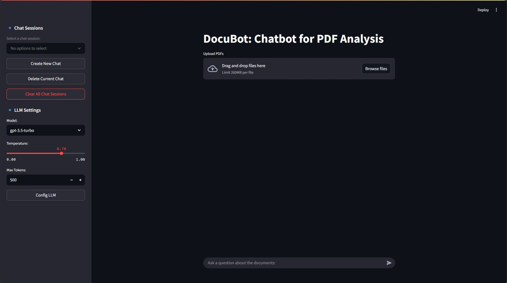
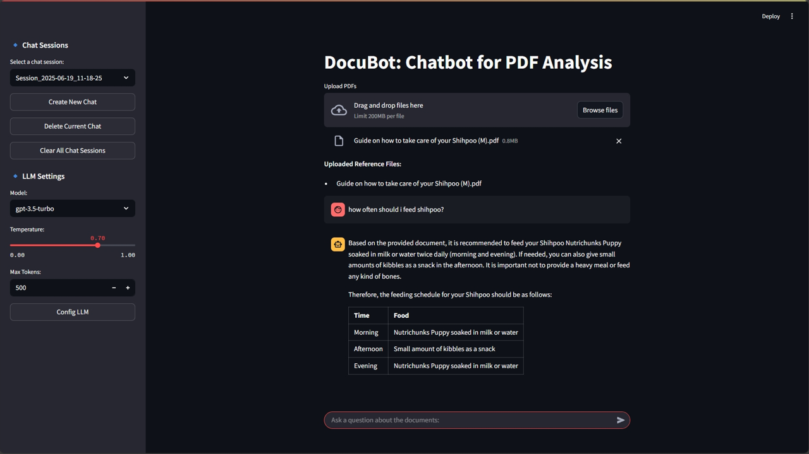

# DocuBot: Chatbot for PDF Analysis

## Dependencies
Skip this if you are planning to run the application using containerized execution. You may install the dependencies using the following command:

    pip install streamlit pdfplumber openai langchain chromadb python-dotenv langchain-community tiktoken

## Configuring OpenAI API Key
To run this application you need to set the OpenAI API key in the *.env* file. In the *.env* file, set the variable OPENAI_API_KEY with your own openAI API key:

    OPENAI_API_KEY=your_openAI_API_key

## Running the Application
Option 1: Direct Execution

To run the application, run the following command on your CLI inside the project folder:

    streamlit run main.py

Option 2: Containerized Execution

To run the application, run the following commands on your CLI inside the project folder:

    docker build -t docubot_image .
    docker run -d -p 8501:8501 --name docubot_container docubot_image

Open http://localhost:8501/ to view the application.

## General Overview of the Application



To use to application, upload a PDF. Once a PDF is successfully uploaded, a text similar to the one below will appear.

> Uploaded Reference Files: your_pdf_file.pdf

You may then ask questions related to the uploaded documents. 
If no file is uploaded, you will be notifed to upload a PDF first. The application can handle many file uploads. 
For multiple PDF uploads, you can remove an uploaded file as a reference for the chatbot by clicking the "X" button that appears beside the file name after successful file upload.

You may start a new chat session by clicking the "*Create New Chat*" button on the left sidebar. Your current chat session will be automatially saved. You may also "*Delete Current Chat*" or "*Clear All Chat Sessions*". You may also choose which chat session to load and continue the session.

You may also configure the settings of the LLM on the left sidebar by selecting the model, temperature, and max tokens values for the LLM. Click the "*Conifg LLM*" button to apply the chosen parameter values.

# Project Journal
## Design Decisions and Solutions Implemented
The development of the DocuBot application was driven by the need to create a scalable, modular, and efficient chatbot for analyzing PDF documents. By leveraging Streamlit, LangChain, and OpenAI’s LLM, the architecture prioritizes modular code design, session-based conversation management, and dynamic LLM configuration.

One of the core design decisions was structuring the application into three separate Python files:

- *main.py:* Handles core functionality, including UI management, document processing, and chatbot interactions.

- *session_manager.py:* Manages chat sessions, ensuring that previous conversations and context are accessible when needed.

- *llm_config.py:* Provides a dynamic interface for configuring LLM parameters, making chatbot responses customizable.

This modular approach ensures easier debugging, scalability, and separation of concerns. Each component serves a specific function, reducing interdependencies that could hinder future improvements.

To maintain conversational continuity, chat sessions are stored in JSON files, preserving user messages, document texts for context, and uploaded filenames. The session manager ensures chat history retrieval for ongoing discussions, proper resetting of messages and documents when new sessions begin, and efficient deletion and clearing of old sessions. This provides a seamless user experience, preventing unnecessary data loss while keeping interactions organized.

- A sample JSON file that stores a chat session is shown below.

   ```json
    {
        "messages": [
            {
                "role": "user",
                "text": "how often should i feed shihpoo?"
            },
            {
                "role": "assistant",
                "text": "Based on the provided document, it is recommended to feed your Shihpoo Nutrichunks Puppy soaked in milk or water twice daily (morning and evening). If needed, you can also give small amounts of kibbles as a snack in the afternoon. It is important not to provide a heavy meal or feed any kind of bones. \n\nTherefore, the feeding schedule for your Shihpoo should be as follows:\n\n| Time       | Food                                       |\n|------------|--------------------------------------------|\n| Morning    | Nutrichunks Puppy soaked in milk or water |\n| Afternoon  | Small amount of kibbles as a snack        |\n| Evening    | Nutrichunks Puppy soaked in milk or water |"
            }
        ],
        "document_texts": [
            "You have\nThank you for\nchosen a\nchoosing us.\nPuppy Boy!\n-Pamilya Ko\nKennel\nNext Guide on how to take\ncare of your Shihpoo\nBy: Pamilya Ko Kennel\nNext 1.Always check his Vet card for\nscheduled vaccination,\ndeworming, etc.\n2. He is currently eating soft\nfoods since his teeth are still tiny\nand sensitive. Please feed him\nNutrichunks Puppy soaked in\nmilk or water twice daily\n(morning and evening). If you feel\nthat he needs to eat in the\nafternoon you can give him small\namount of kibbles as snack (not\nheavy meal)\n3. You can give him toys to play\nwith but those that are not easily\nswallowed. Do not let him chew\nyour slippers or anything from\nthe outside nor let him walk\noutside since he is not yet fully\nvaccinated.\nNext 4. Its almost rainy season. If\npossible let him stay inside since\nparvo, distemper and other\nvirus/ bacteria are active during\nwet and cold season.\n5. Do not feed him any kind of\nbones cause his teeth is not yet\ncapable of chewing. It could also\nchoke him. Puppy teeth will be\nreplaced by less sharp and big\nth th\nones on his 6 to 8 months\n6. For increase appetite, you can\nbuy vitamins for him from the\nVet given once daily.\n7. Puppies are very playful. Note\nto be careful while playing with\nthem. Anti Rabies vaccines will be\nrd\ngiven to him on his 3 month\ntogether with the last shot of 6\nin 1.\nNext 8. From 6 months old you need to\nadminister deworming every 3\nmonths\n9. Regular grooming starts on his\nth\n8 month. Before that you can\ntry to trim her fur around her\nEyes, Feet, bum and Ear.\nRemember to be careful on\ncutting.\n10. Always clean him after eating\nand pooping by using wet towels\nor wipes. Clean areas around the\neyes, mouth, ears, paw and bum.\nYou can give her a bath once a\nweek or depending on your liking.\nFor other concerns, you can\nalways reach me. Please note\nthat I am not an expert but\nexperience helped me to gain\nideas on how to take care of my\nPets. Good luck!"
        ],
        "uploaded_file_names": [
            "Guide on how to take care of your Shihpoo (M).pdf"
        ]
    }

On UI, the saved JSON file above looks like the image below.



Handling PDF uploads and text extraction required refining the pipeline to ensure multi-page extraction, whitespace and formatting adjustments, proper document text segmentation using RecursiveCharacterTextSplitter. This preprocessing step ensures that vector embeddings for document queries remain accurate and contextually relevant when answering user questions.

## Challenges Faced
I encountered a limitation in Streamlit's UI where, if only one file is uploaded or is remaining in the UI, the stored list of uploaded files does not refresh automatically. Because of this, after uploading PDFs and then removing them by clicking all the "X" buttons, the last remaining file is still retained in my session history (and therefore the json file) instead of being cleared. Although it must be noted that this saved file (or context in the json file) can be replaced by uploading again another PDF.

## Prompt Engineering Strategies
Structured instructions are used for the prompts to get refined responses. The prompt engineering strategy used ensures responses are fact-driven, well-structured, and user-friendly to optimize formatting, contextual awareness, and conversational flow using langchain prompt template. The following prompt was used:

    prompt_template = PromptTemplate(
                input_variables=["context", "question"],
                template="""
                    You are a document analysis assistant. Given the document, format your response clearly and neatly.

                    Context:
                    {context}

                    Question:
                    {question}

                    Make your answer clear, concise, and fact-based.

                    If the document doesn't contain relevant information, say so.

                    If the answer contains numerical data, output a well-structured table with headers.

                    If summarizing, provide a brief, well-structured overview with key bullet points.

                    If this question relates to a previous query, reference past responses before answering.

                    If clarification is needed, politely ask the user before responding.
                    """
            )

